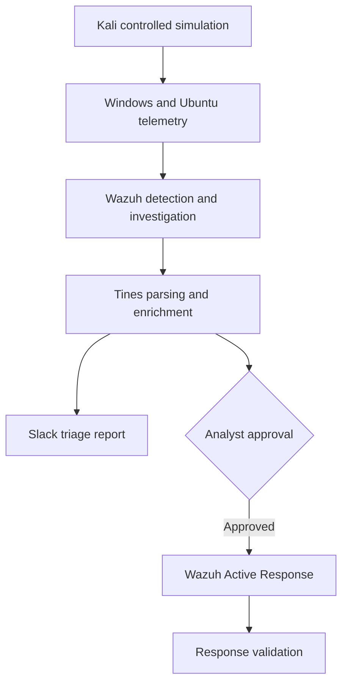
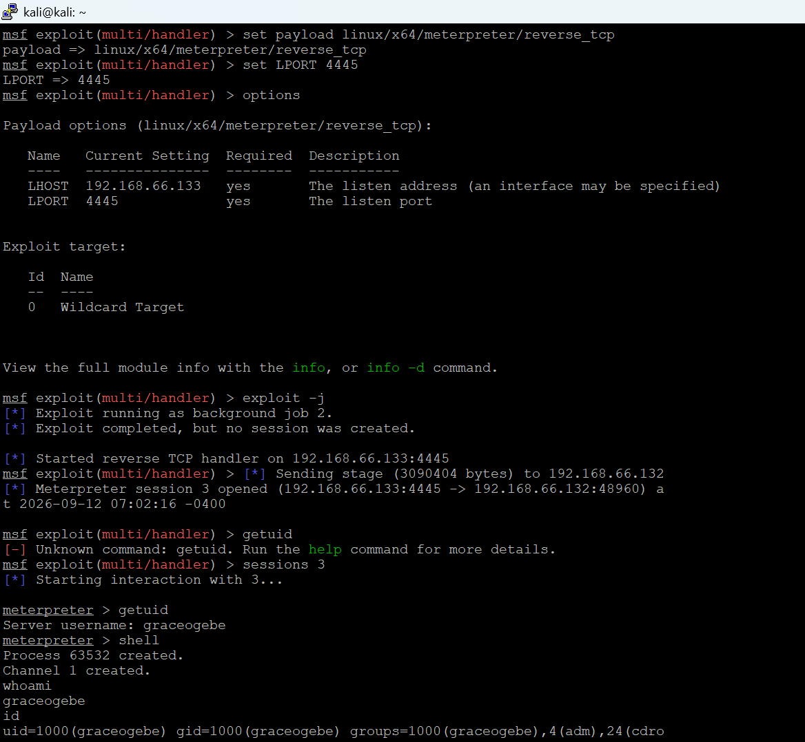
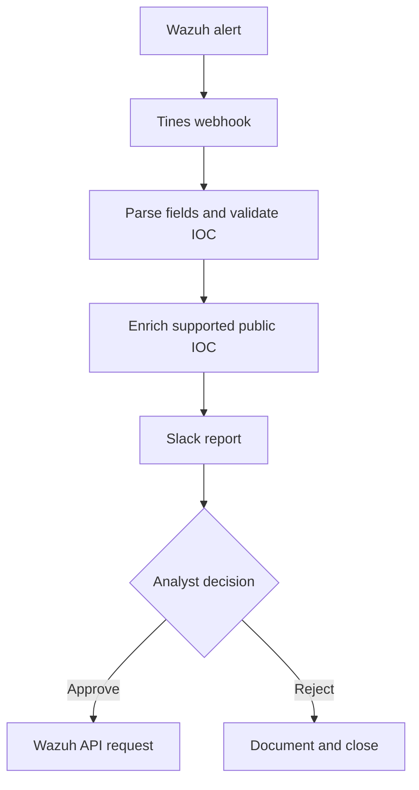

# Wazuh SIEM and Tines SOAR Detection and Response Lab

## Project Summary

I built a four-system Security Operations Centre lab to collect Windows and Linux telemetry, create custom detections, investigate suspicious activity, enrich alerts, and test analyst-approved containment.

I deployed Wazuh as the central SIEM, connected Windows and Ubuntu agents, added Sysmon telemetry, generated controlled attack activity from Kali Linux, created custom Wazuh rules, and built a Tines SOAR workflow. The workflow sent investigation findings to Slack, requested human approval, and submitted an Active Response request to the affected Wazuh agent.

All activity took place inside an isolated VMware network. The addresses shown are private RFC 1918 lab addresses. This repository records work I completed, evidence I reviewed, problems I resolved, and limitations I identified.

## Key Results

| Result | Evidence |
|---|---|
| Deployed one Wazuh server with manager, indexer, dashboard, and API services | [Server deployment report](reports/01-Wazuh-Server-Deployment.md) |
| Enrolled two monitored agents across Windows and Ubuntu | [Agent and Sysmon report](reports/02-Agent-Deployment-and-Sysmon-Integration.md) |
| Collected Windows Security, Sysmon, SSH, authentication, process, registry, and network telemetry | [Telemetry investigation report](reports/03-Telemetry-Generation-and-Security-Investigation.md) |
| Created a level 10 rule for three SSH failures from one source within 120 seconds | [Detection and response report](reports/04-Detection-Dashboard-Active-Response-and-Final-Investigation.md) |
| Configured a level 12 rule for the Windows Guest account being enabled | [Detection and response report](reports/04-Detection-Dashboard-Active-Response-and-Final-Investigation.md) |
| Established controlled Windows and Linux Meterpreter sessions, documented endpoint activity, and confirmed Windows `whoami` telemetry in Wazuh | [Telemetry investigation report](reports/03-Telemetry-Generation-and-Security-Investigation.md) |
| Sent Wazuh alerts to Tines and investigation findings to Slack | [Detection and response report](reports/04-Detection-Dashboard-Active-Response-and-Final-Investigation.md) |
| Added analyst approval before containment | [Human approval evidence](images/21-human-approval-page.png) |
| Validated the response through Tines activity, Wazuh response telemetry, and changed endpoint connectivity | [Response validation](#response-validation) |

## Architecture


| System | Address | Purpose |
|---|---|---|
| Wazuh server | `192.168.66.128` | Manager, indexer, dashboard, API, detection, and central investigation |
| Windows 10 | `192.168.66.131` | Monitored endpoint with Wazuh agent and Sysmon |
| Ubuntu | `192.168.66.132` | Monitored Linux endpoint, SSH target, and Active Response target |
| Kali Linux | `192.168.66.133` | Authorised attack-simulation system |



## Technology Used

| Area | Technology |
|---|---|
| Virtualisation | VMware Workstation |
| SIEM and endpoint monitoring | Wazuh manager, indexer, dashboard, API, and agents |
| Windows telemetry | Windows Security auditing and Sysmon |
| Linux telemetry | Ubuntu authentication, SSH, system, and process logs |
| Attack simulation | Kali Linux, `msfvenom`, `msfconsole`, Meterpreter, and SSH testing |
| Automation | Tines |
| Threat enrichment | VirusTotal and AbuseIPDB for supported public indicators |
| Analyst communication | Slack |
| Response | Wazuh Active Response and the Linux `firewall-drop` script |

## Detection Coverage

| Scenario | Data source | Detection or query | Validation status |
|---|---|---|---|
| Windows account creation | Windows Security | Event ID `4720` | Observed in Wazuh for local account `student1` |
| Windows account deletion | Windows Security | Event ID `4726` | Observed |
| Successful Windows logon | Windows Security | Event ID `4624`, Logon Type `5` | Observed in Wazuh as a service logon. This was not treated as proof of unauthorised account use. |
| Guest account enabled | Wazuh custom rules | Event ID `4722`, custom rule `100200` | Triggered and observed in Wazuh |
| Repeated SSH failures | Ubuntu authentication logs | Custom rule `100101`, level 10, three events within 120 seconds | Triggered and observed in Wazuh |
| Process discovery | Sysmon | `whoami`, process, parent process, and command-line searches | Observed |
| Local group membership change | Windows Security | Event ID `4732` | Observed in Wazuh when `student1` was added to the local Administrators group |
| Successful SSH authentication | Ubuntu authentication logs | Accepted-password event and session start | Observed for `graceogebe` from `192.168.66.131` |
| Outside-hours security activity | Wazuh archives and scripted field | `outside_working_hours` with hour before `07:00` or at/after `18:00` | Dashboard created and populated |
| Registry persistence | Windows command evidence | `CalcPersist` Run key | Command completed. A matching Wazuh registry event was not isolated in the selected evidence. |
| Windows reverse connection | Sysmon and Wazuh | Process and network correlation | Observed during authorised simulation |
| Linux payload transfer and execution | Ubuntu and Wazuh | File transfer, permission, execution, and network review | Observed during authorised simulation |

## Main Investigation: Repeated SSH Authentication Failures

### Findings

I generated repeated failed SSH authentication attempts from Windows `192.168.66.131` against user `graceogebe` on Ubuntu `192.168.66.132`.

Wazuh correlated three failures from the same source within 120 seconds and generated custom rule `100101` at level 10. The alert identified the source address, target account, affected agent, timestamp, and authentication context.


### 5Ws and How

| Question | Finding |
|---|---|
| Who | Windows `192.168.66.131` targeted user `graceogebe` on Ubuntu agent `002`. I reviewed the evidence and approved the lab response. |
| What | Three failed SSH authentication attempts triggered custom correlation rule `100101`. |
| When | The alert sequence occurred on 24 September 2026 at approximately `16:28 UTC`. Response testing followed on 28 September 2026. |
| Where | The activity travelled across the isolated `192.168.66.0/24` lab network from Windows to Ubuntu. Wazuh at `192.168.66.128` analysed the events. |
| Why | I generated the activity to test detection, triage, approval, containment, and response validation. |
| How | Ubuntu recorded the failures. Wazuh correlated them. Tines processed the alert. I approved the response, and Wazuh sent the selected IP to the Ubuntu response script. |

### Classification

| Attribute | Value |
|---|---|
| Disposition | True positive for the controlled lab scenario |
| ATT&CK technique | `T1110`, Brute Force |
| Rule | `100101`, level 10 |
| Source | `192.168.66.131` |
| Target | Ubuntu agent `002`, `192.168.66.132` |
| Target account | `graceogebe` |
| Production impact | None |

## Detection Engineering

I created and tested custom rules for repeated SSH failures and Guest account activation.

```xml
<group name="local,syslog,sshd,authentication_failed,">
  <rule id="100101" level="10" frequency="3" timeframe="120">
    <if_matched_sid>5760</if_matched_sid>
    <same_source_ip />
    <description>Multiple SSH login failures observed from the same source IP</description>
    <mitre>
      <id>T1110</id>
    </mitre>
    <group>authentication_failed,ssh_bruteforce,credential_access,</group>
  </rule>
</group>
```

My test process included XML validation, rule testing, event generation, alert confirmation, extracted-field review, and false-positive assessment.


## Controlled Threat Simulation

I used `msfvenom` and `msfconsole` inside the isolated lab to create known Windows and Linux reverse-connection activity. I investigated observable behaviour rather than treating the exercise as an external compromise.

The Windows simulation produced process execution, command-shell, identity discovery, network discovery, local account creation, group membership, registry Run-key, and reverse-connection telemetry.

The Ubuntu simulation produced retained endpoint, Metasploit, and Wazuh evidence for file transfer, permission change, execution, shell activity, successful SSH authentication, session creation, user discovery, account-file review, operating-system discovery, and the reverse connection. I did not retain an equally clear Wazuh event screenshot for every Linux action.




Detailed commands, timestamps, findings, and evidence appear in the [telemetry and security investigation report](reports/03-Telemetry-Generation-and-Security-Investigation.md).

## Tines SOAR Workflow

I configured Tines to receive the Wazuh alert, extract investigation fields, process supported indicators, produce a structured triage report, send the report to Slack, request analyst approval, and submit an approved response request to Wazuh.



### IOC Parsing Issue Resolved

My first extraction returned a nested array containing escaped quotation marks. This produced malformed JSON and an invalid `srcip` value.

I corrected the transformation and verified one plain IPv4 value before constructing the API request.

Expected value:

```json
{
  "srcip": "192.168.66.131"
}
```


The exact field expression depends on the final Tines event structure. The response action must receive one string rather than a nested array. I retained this distinction because an API success status does not prove correct endpoint execution.

### Threat-Intelligence Handling

The SSH source was an RFC 1918 private address. I excluded it from public reputation scoring and relied on internal Wazuh telemetry for assessment.

The response routes should remain indicator-specific:

| Indicator | Appropriate response path |
|---|---|
| IP address | Firewall or network block after validation |
| Domain | DNS, proxy, or secure web gateway control |
| File hash | EDR prevention or quarantine action |
| User account | Identity investigation, disablement, or credential reset |
| Host | Endpoint isolation through a tested platform-specific control |

### Human Approval

I placed a human approval decision before the containment request. This reduced the risk of blocking a trusted administrator, gateway, scanner, DNS server, Wazuh component, or other protected system.


## Response Validation

I used three evidence sources to assess the response:

1. Tines recorded the approved API action.
2. Wazuh recorded the Active Response program and `srcip` value.
3. Connectivity from the same Windows source changed from replies to timeouts.


This evidence supports successful response execution. Ubuntu displayed DROP rules for `192.168.66.131` in the INPUT and FORWARD chains, and the rules were removed in a controlled cleanup. The retained evidence does not show a new connectivity test after removal, so post-unblock connectivity remains unverified.

## MITRE ATT&CK Mapping

| Technique | Name | Evidence status |
|---|---|---|
| `T1110` | Brute Force | Repeated SSH failures observed and correlated |
| `T1021.004` | Remote Services: SSH | SSH authentication activity observed |
| `T1136.001` | Create Account: Local Account | Controlled local account creation observed |
| `T1098` | Account Manipulation | Controlled administrator-group change observed |
| `T1547.001` | Registry Run Keys / Startup Folder | Controlled `CalcPersist` Run-key change observed |
| `T1059.001` | PowerShell | PowerShell telemetry observed |
| `T1059.003` | Windows Command Shell | Controlled Windows shell activity observed |
| `T1059.004` | Unix Shell | Controlled Ubuntu shell activity observed |
| `T1033` | System Owner/User Discovery | `whoami` and identity checks observed |
| `T1016` | System Network Configuration Discovery | `ipconfig` activity observed |
| `T1087.001` | Account Discovery: Local Account | Linux user and group discovery observed |
| `T1548.002` | Bypass User Account Control | Controlled `fodhelper` simulation observed |
| `T1105` | Ingress Tool Transfer | Linux test file transfer observed. Separate SOAR payload fields remained synthetic. |
| `T1095` | Non-Application Layer Protocol | Controlled reverse TCP connections observed |

I did not classify the Event ID `4624` service logon as Valid Accounts because the evidence does not show unauthorised account use. I also removed File Deletion from confirmed coverage because the current evidence does not prove deletion activity.

## Problems I Resolved

| Problem | Action and outcome |
|---|---|
| Wazuh manager failed after configuration edits | I found malformed XML, corrected mismatched or duplicated tags, validated the file, and restored the service. |
| Ubuntu agent failed to start | I corrected invalid closing tags and removed extra content from `ossec.conf`. |
| Tines sent a blank agent ID | I mapped the alert agent ID into the `agents_list` query parameter. |
| IOC arrived as nested data with escaped quotes | I normalised the value before building the response body. |
| API request did not produce the expected block | I checked the target agent, response script, `srcip`, execution path, and Wazuh response telemetry. |
| Public reputation services offered no useful result | I classified the IOC as private and relied on internal telemetry. |
| Automatic containment created false-positive risk | I added analyst approval before the response request. |

## Limitations and Remaining Work

This project used two monitored endpoints and does not represent production scale.

Public threat-intelligence enrichment was not meaningful for the private SSH source.

The AI triage stage depended on evidence present in the webhook. It did not replace analyst verification.

Changed ping behaviour supported the containment assessment but did not replace endpoint firewall-rule evidence.

Windows and Linux require separate response scripts. A single `firewall-drop` path does not provide cross-platform containment.

The retained evidence includes both the earlier source-event test under rule `5710` and the later custom Wazuh rule `100101` alert. This supports the source-event-to-correlation path.

I still need to record a successful connectivity test after the unblock, measure alert-to-triage time, and calculate false-positive rates across repeated tests.

## Skills Demonstrated

Wazuh deployment and administration, cross-platform telemetry collection, Sysmon analysis, custom rule development, event correlation, threat hunting, MITRE ATT&CK mapping, controlled adversary simulation, 5Ws and How reporting, SOAR development, IOC validation, threat-intelligence judgement, human-in-the-loop response, troubleshooting, and evidence-based validation.

## Detailed Reports

1. [Wazuh Server Deployment](reports/01-Wazuh-Server-Deployment.md)
2. [Agent Deployment and Sysmon Integration](reports/02-Agent-Deployment-and-Sysmon-Integration.md)
3. [Telemetry Generation and Security Investigation](reports/03-Telemetry-Generation-and-Security-Investigation.md)
4. [Detection Engineering, Dashboard, SOAR, and Final Investigation](reports/04-Detection-Dashboard-Active-Response-and-Final-Investigation.md)
5. [Evidence Index](EVIDENCE-INDEX.md)

## Repository Structure

```text
Wazuh-SIEM-Tines-SOAR-Lab/
├── README.md
├── EVIDENCE-INDEX.md
├── images/
├── evidence/
└── reports/
```

## Acknowledgement

This project developed from the MYDFIR Wazuh Challenge. I extended the exercises through custom detections, multi-platform telemetry analysis, controlled threat simulation, SOAR integration, troubleshooting, evidence validation, and structured investigation reporting.

## Author

Eneattah Grace Ogebe

Cybersecurity Analyst focused on Security Operations and Cyber Threat Intelligence.
