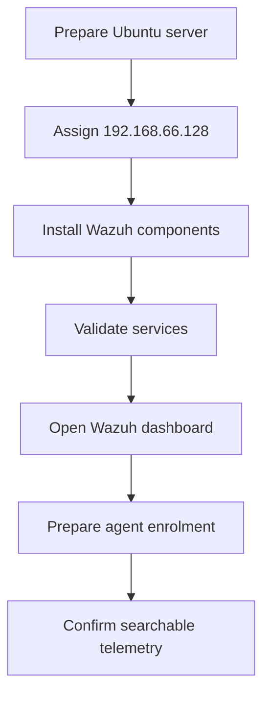
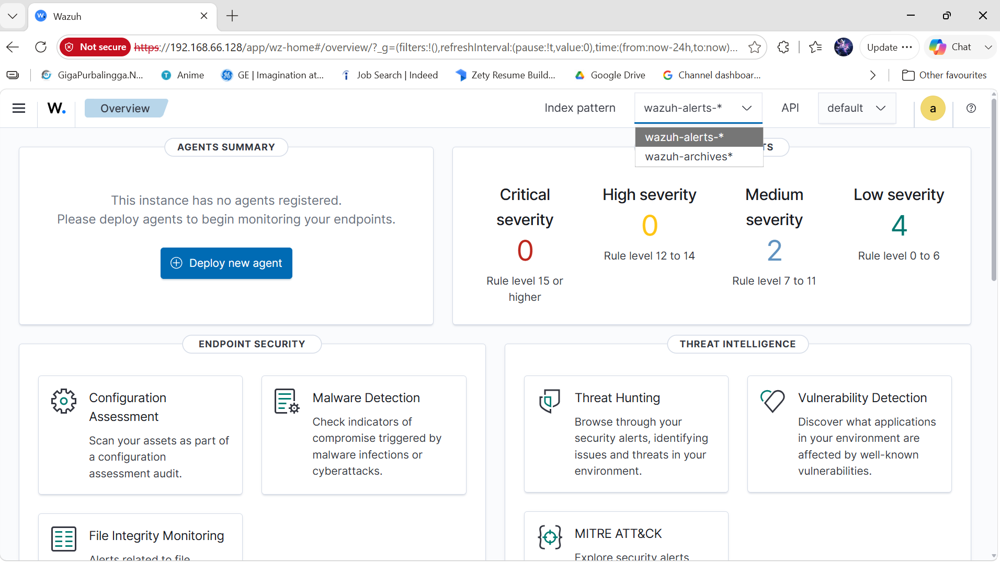
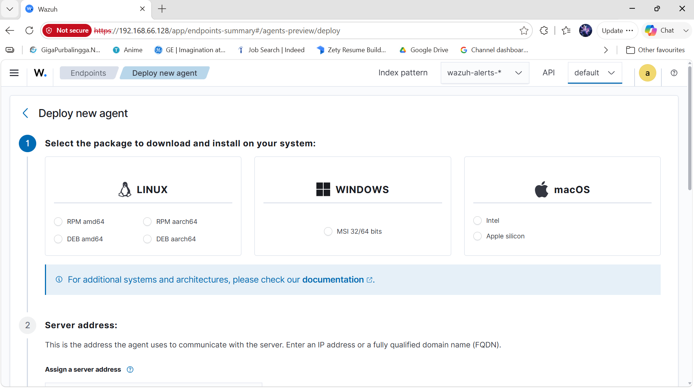
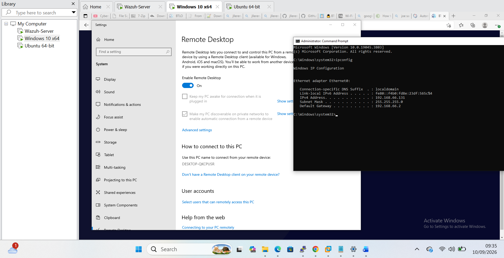
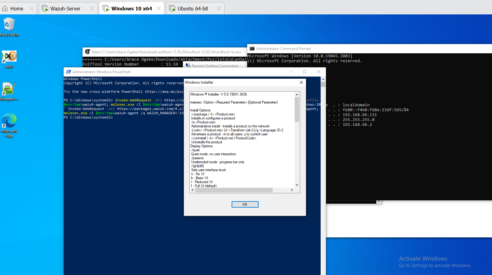
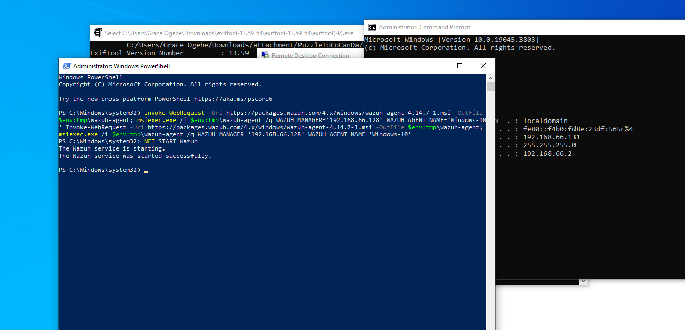
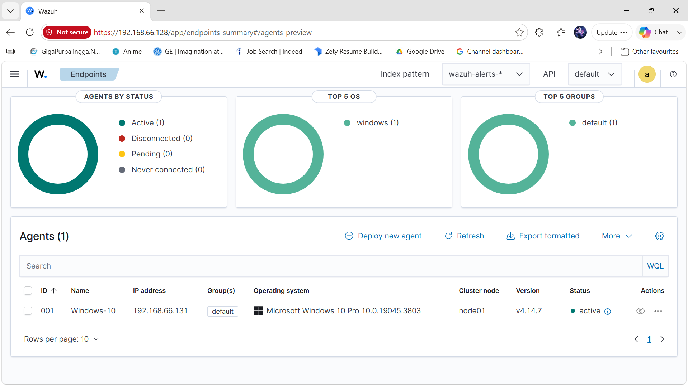
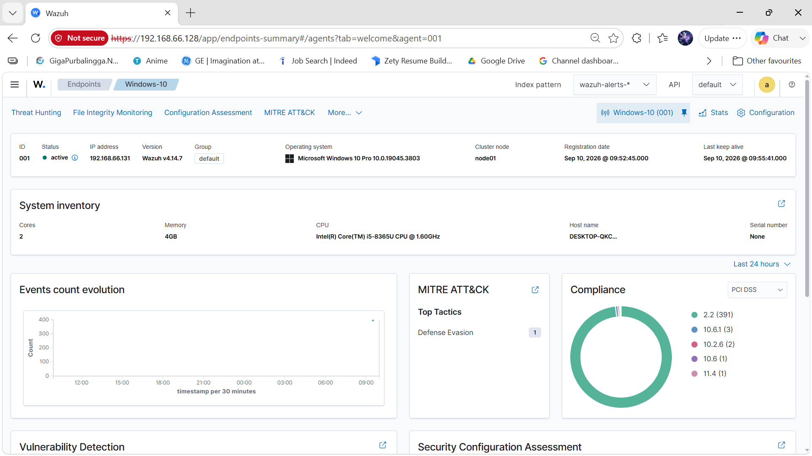
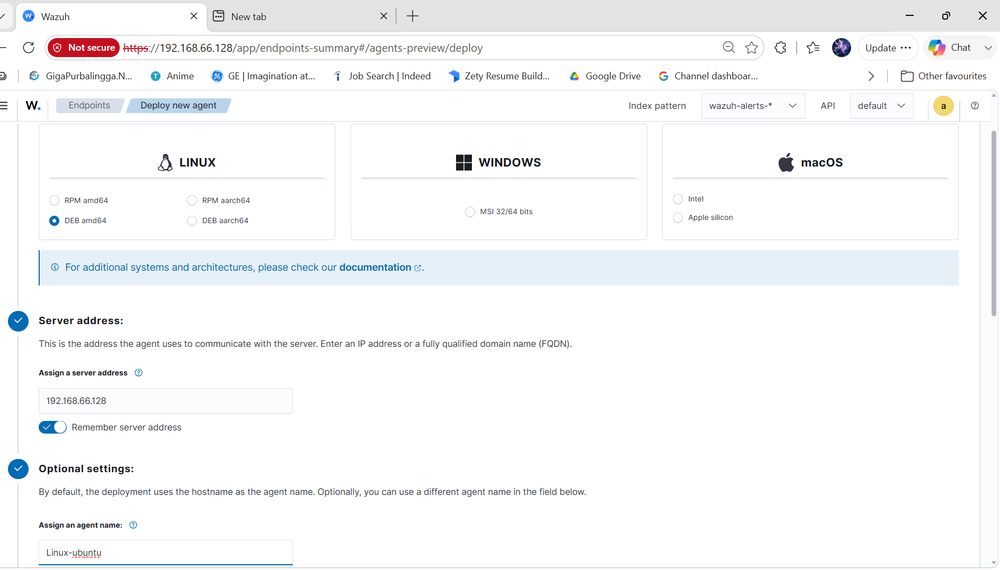
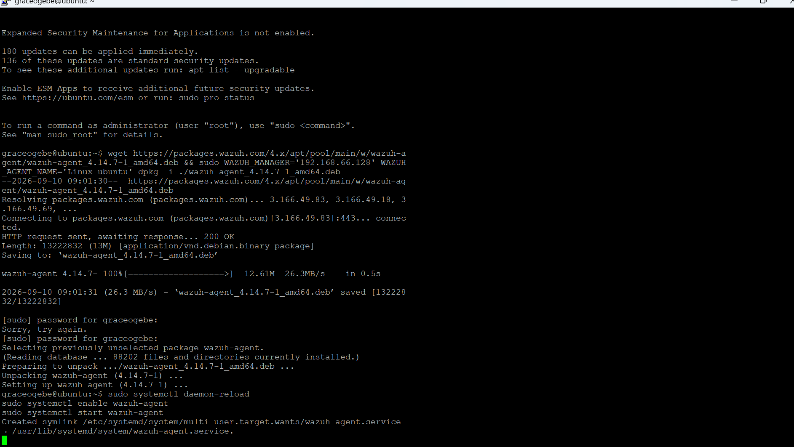

# Report 1: Wazuh Server Deployment

## Infrastructure Deployment and Validation

## My Proof of Work

I designed, deployed, configured, and validated the Wazuh server used for my SOC lab. I built it in a private VMware environment and used it as the foundation for endpoint monitoring, detection, investigation, SOAR, and active response. The screenshots in this report are evidence of the work I completed.

## Project Overview

In the first phase, I established the central SIEM platform. I hosted the Wazuh manager, indexer, dashboard, and API on `192.168.66.128`. I then used the server to receive security telemetry from Windows and Ubuntu agents, forward alerts to Tines, and deliver approved response commands to the affected agent.

## Tools Used

| Tool | Purpose |
|---|---|
| VMware Workstation | Hosted the isolated virtual lab |
| Ubuntu Server | Hosted the Wazuh all-in-one deployment |
| Wazuh Manager | Decoded events and evaluated detection rules |
| Wazuh Indexer | Stored alerts and security data |
| Wazuh Dashboard | Supported searches, dashboards, and investigations |
| Wazuh API | Supported administration and response orchestration |
| Linux command line | Supported deployment, service checks, and troubleshooting |

## Skills I Demonstrated

- SIEM infrastructure planning
- Private network design
- Wazuh server deployment
- Linux service administration
- Configuration validation
- Wazuh API preparation
- Fault isolation and service recovery

## Deployment Flow



## Deployment Record

| Area | Completed work |
|---|---|
| Owner | I deployed and administered the lab. |
| System | I deployed a central Wazuh SIEM environment to receive, index, analyse, and display Windows and Linux security telemetry. |
| Period | I built and tested the server during September 2026. |
| Location | I used an isolated VMware network on the private subnet `192.168.66.0/24`. |
| Purpose | The server supported monitoring, detection engineering, threat hunting, investigation, alert forwarding, and Active Response. |
| Validation | I checked network access, service health, dashboard access, and agent communication before endpoint testing. |

## Work I Completed

1. I built a central Wazuh server.
2. I assigned it the fixed private IP address `192.168.66.128`.
3. I confirmed the manager, indexer, dashboard, and API services.
4. I accessed the dashboard from my analyst workstation.
5. I prepared the server for Windows and Ubuntu agents.
6. I established the foundation for my detection and response work.

## Lab Architecture


| System | IP address | Role |
|---|---|---|
| Wazuh server | `192.168.66.128` | Manager, indexer, dashboard, API, and central analysis |
| Windows 10 | `192.168.66.131` | Windows endpoint and Sysmon telemetry source |
| Ubuntu | `192.168.66.132` | Linux endpoint, SSH target, and authentication telemetry source |
| Kali Linux | `192.168.66.133` | Authorised attack-simulation system |

## Server Components

| Component | Function |
|---|---|
| Wazuh manager | Receives agent events, applies decoders and rules, and produces alerts |
| Wazuh indexer | Stores alerts and searchable security data |
| Wazuh dashboard | Supports searches, dashboards, visualisations, and investigation |
| Wazuh API | Supports administration and the later Tines active-response workflow |

## Deployment Process

### 1. Virtual Machine Preparation

I placed the Wazuh server on the private lab subnet and assigned it `192.168.66.128`. My addressing plan kept each endpoint identifiable during investigations and separated the test systems from external infrastructure.

### 2. Wazuh Installation

I used an all-in-one Wazuh deployment and placed the manager, indexer, dashboard, and API on the same virtual machine. I selected this design because it reduced hardware demand and simplified management in my home lab.

### 3. Network Validation

I checked direct communication between the lab systems before agent enrolment. I focused on:

- Correct private IP addresses
- Reachability between the endpoints and Wazuh server
- Dashboard access from the analyst workstation
- Required Wazuh communication paths
- Consistent time settings for event comparison

### 4. Service Validation

The following service checks supported deployment validation:

```bash
sudo systemctl status wazuh-manager
sudo systemctl status wazuh-indexer
sudo systemctl status wazuh-dashboard
```

The manager configuration was tested before restarts:

```bash
sudo /var/ossec/bin/wazuh-analysisd -t
```

### 5. Dashboard Validation

I confirmed that the Wazuh dashboard loaded successfully and displayed my connected agents, security events, custom rules, dashboards, and active-response evidence.



## Configuration Management

XML validation became an important part of the deployment. Earlier configuration errors caused the Wazuh manager to fail after edits. The problems included mismatched tags, duplicated content, and text placed after the closing `</ossec_config>` element.

The XML file was checked with:

```bash
sudo xmllint --noout /var/ossec/etc/ossec.conf
```

I used the following change-control process:

1. Back up the configuration file.
2. Apply one change at a time.
3. Check the XML structure.
4. Test the Wazuh configuration.
5. Restart the affected service.
6. Confirm service health.
7. Review the manager log for errors.

## Validation Results

| Validation item | Expected result | Outcome |
|---|---|---|
| Server uses the planned address | Wazuh available at `192.168.66.128` | Achieved |
| Manager service runs | Active service status | Achieved |
| Indexer stores data | Searchable Wazuh indices | Achieved |
| Dashboard loads | Web interface available | Achieved |
| API supports authentication | Token request accepted | Achieved |
| Endpoints reach the server | Windows and Ubuntu agents later connect | Achieved |
| Configuration survives restart | Services return to active state | Achieved after XML corrections |

## Challenges and Resolutions

| Challenge | Cause | Resolution |
|---|---|---|
| Wazuh manager failed to start | Invalid XML structure in `ossec.conf` | Corrected mismatched tags and removed extra content |
| Configuration changes caused service interruption | Changes were restarted before full validation | Added XML and Wazuh syntax checks before restart |
| Event timestamps required comparison | Systems displayed different timezone contexts | Retained source timestamps and reviewed system time settings |
| Dashboard data depended on later agents | No endpoint telemetry existed during the initial build | Completed server health checks before enrolling endpoints |

## Security and Operational Decisions

- The server remained on a private lab subnet.
- The Wazuh server address was treated as protected infrastructure.
- The active-response workflow excluded the manager from automated blocking.
- Configuration files were validated before service restart.
- Lab IP addresses and credentials were kept separate from production systems.
- Testing occurred only on systems owned and controlled by the analyst.

## What I Achieved

- A working Wazuh server at `192.168.66.128`
- Central manager, indexer, dashboard, and API services
- Dashboard access for SOC monitoring
- A stable base for Windows and Ubuntu agents
- A repeatable configuration-validation process
- A protected management system for later response automation

## Recommendations Based on My Findings

1. Keep the Wazuh server on a protected management segment.
2. Back up `ossec.conf`, local rules, decoders, and API configuration before major changes.
3. Validate XML and Wazuh syntax before every service restart.
4. Monitor disk use, index health, service availability, and certificate expiry.
5. Synchronise system time across every endpoint.
6. Restrict API access and rotate authentication material.
7. Exclude the Wazuh manager from automated blocking workflows.

## Evidence Summary

| Evidence | Meaning |
|---|---|
| Dashboard overview | Confirms access to the Wazuh interface |
| Agent status shown in later testing | Confirms endpoint-to-manager communication |
| Search and dashboard results | Confirms indexing and analysis |
| Active-response API evidence | Confirms API integration |
| Corrected service state | Confirms configuration recovery |

## What I Learned

1. SIEM accuracy depends on stable infrastructure and time alignment.
2. I learned to validate XML before every manager restart.
3. Fixed lab addresses simplify endpoint attribution.
4. A working dashboard does not prove full ingestion. Agent and event checks remain necessary.
5. The Wazuh server requires protection from response actions intended for monitored endpoints.

## Complete Screenshot Evidence

The following images preserve the original server-deployment evidence in sequence. They show the Wazuh installation, virtual machines, network preparation, initial dashboard access, and early validation.

| Evidence 001 | Evidence 002 |
|---|---|
|  |  |

| Evidence 003 | Evidence 004 |
|---|---|
|  |  |

| Evidence 005 | Evidence 006 |
|---|---|
|  |  |

| Evidence 007 | Evidence 008 |
|---|---|
|  |  |

| Evidence 009 | Evidence 010 |
|---|---|
|  |  |


## Next Report

[Report 2: Agent Deployment and Sysmon Integration](02-Agent-Deployment-and-Sysmon-Integration.md)
